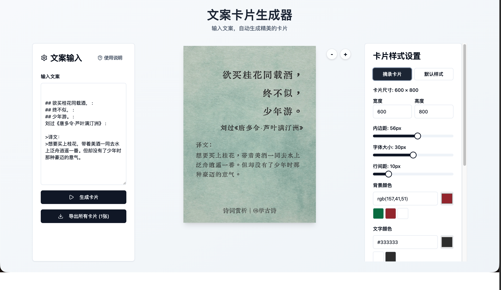

# 文案卡片生成器

一款基于 React + Vite + Tailwind CSS 的卡片生成工具，支持 Markdown 语法、智能文本分割和图片导出。



## 功能特性

- **Markdown 支持**：支持粗体、斜体、代码、标题、引用、列表等常用语法
- **智能分割**：自动将长文本分割到多张卡片，平衡空间利用
- **背景图支持**：上传背景图片，导出时保持一致
- **多种对齐**：支持左对齐、居中、右对齐（通过 `:文字:` 语法）
- **快捷样式**：一键切换「摘录卡片」和「默认样式」
- **版权信息**：可自定义底部版权文本和位置
- **高清导出**：支持 3x 分辨率 PNG 导出

## 快速开始

### 安装依赖

```bash
npm install
```

### 启动开发服务器

```bash
npm run dev
```

### 构建生产版本

```bash
npm run build
```

## 使用指南

### Markdown 语法

| 语法 | 说明 | 示例 |
|------|------|------|
| `**粗体**` | 加粗文本 | **粗体** |
| `*斜体*` | 斜体文本 | *斜体* |
| `` `代码` `` | 行内代码 | `code` |
| `# 一级标题` | 字体 1.6 倍 | - |
| `## 二级标题` | 字体 1.4 倍 | - |
| `- 列表项` | 带左边距列表 | - |
| `> 引用` | 灰色透明引用 | - |

### 对齐语法

| 语法 | 对齐方式 |
|------|----------|
| `: 左对齐文字` | 左对齐 |
| `: 居中文字 :` | 居中对齐 |
| `右对齐文字 :` | 右对齐 |

> 注意：英文冒号前后需要空格，避免与中文冒号冲突

### 快捷样式

- **摘录卡片**：大字号（30px）、深色字（#333）、宽内边距（56px）
- **默认样式**：恢复初始默认配置

## 项目架构

```
src/
├── components/          # React 组件
│   ├── CardComponent.jsx    # 卡片渲染组件
│   ├── CardPreview.jsx      # 卡片预览区域
│   ├── CardSettings.jsx     # 样式设置面板
│   └── TextInputCard.jsx    # 文本输入组件
├── config/
│   └── config.js           # 字体配置
├── utils/
│   ├── exporter.js          # 导出功能
│   └── textSplitter.js      # 文本分割逻辑
├── App.jsx             # 主应用组件
├── main.jsx           # 入口文件
└── style.css          # 全局样式
```

## 技术栈

- **框架**：React 19
- **构建工具**：Vite
- **样式**：Tailwind CSS + shadcn/ui
- **导出**：html2canvas
- **图标**：Lucide React

## License

MIT
